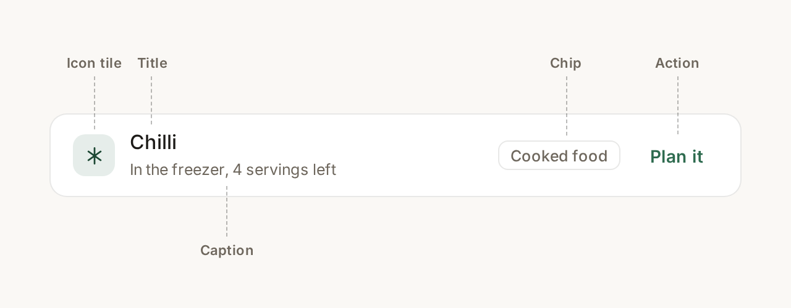

> This document is a work-in-progress and may change rapidly while the app is under development.

## Guiding Philosophy

### 1. The app shall **never** overwhelm the user

Don't overwhelm the user with information, options or controls.
Present exactly what they need to know to do the job they are there for.

### 2. Show don't tell

Don't over-explain.
Your feature/implementation should not need a wall of text in the app to understand it, if it does then it's either designed incorrectly or the text is superfluous (this seems to be particularly problematic with Claude Code which likes to document every little thing).

### 3. Keep language simple and short

A user should not need a wall of text to understand how to use a field or what they are seeing.
Nor should they need a dictionary to understand the words presented to them.
Keep the language simple and short, it should be understandable by the average person without insulting their indigence.

```markdown
"Items to procure on next retail visit" - ❌ Bad
"Shopping List" - ✅ Good

"Leave empty if this product does not stand in for a generic ingredient." - ❌ Bad
"Optional" - ✅ Good
```

## Components

### The row

Most of this app is a list of things. The row is the unit that makes those lists readable, and it has one anatomy everywhere:



- **Icon tile.** 34 px square, 10 px radius, tinted background, icon inside at 17 px.
- **Title.** One line, weight 500. The name of the thing.
- **Caption.** One line, `caption` size, secondary colour. Supporting detail only.
- **Chip.** Optional. What the thing is or where it lives.
- **Action.** At most one.

Anything that does not fit this shape is either two rows or the wrong component. Do not add a third line to make it fit.

Only the leading element varies. Things that will one day carry a picture, such as people, products, ingredients and recipes, use an **avatar** and fall back to initials until an image exists. Things identified by kind rather than by picture, such as meals, cooking events, dishes and storage, use an **icon tile**. The rest of the row is the same either way.

### Icons

Every repeated row carries a leading icon. This is not decoration, it is how the eye tells one kind of thing from another before reading a word.

A concept gets one icon across the whole app. A dish is always the same icon whether it appears in Stock, the planner, or a dialog. Pick it once.

Use outline icons at 1.9 stroke width. Fill and duotone icon sets are not used.

### Chips

A chip says what something **is** or where it lives: Recipe, Food, Fridge, Freezer, Cooked food.

A chip is never used to report an internal status the user did not create, and never to convey how worried they should be. If the user needs to act, give them an action, not a coloured label.

Chip colour is assigned by kind and is consistent everywhere that kind appears.

### Actions

Each card, dialog or page gets one primary action, and it is the filled green button. Everything else on that surface is a text button.

Destructive actions are text buttons. They are never filled and never red.

Three actions in one row is the practical maximum. Needing more means the surface is doing more than one job.

## Conventions

### Spacing

Spacing comes from the theme's 8 px scale. Do not invent padding at the call site.

| Gap | Use |
| --- | --- |
| 8 px | Between related lines inside a card |
| 16 px | Between groups inside a card, and between cards |
| 24 px | Between page sections, and page padding |

Radii are theme values and are not overridden: 14 px cards and dialogs, 10 px buttons, inputs, rows and tiles, 8 px chips, fully round for pills.

Cards are flat: one hairline border, no elevation, no shadow, no background image.

### Type

Fraunces is reserved for page titles, dialog titles, and a single large number that answers the screen's question. Nothing else: not body text, not buttons, not headings inside a card. Inter is everything else.

| Style | Size | Use |
| --- | --- | --- |
| `h1` | 2.125 rem | Page title |
| `h2` | 1.5 rem | Dialog title |
| `h3` | 1 rem | Section heading inside a card |
| `body2` | 0.875 rem | Secondary content |
| `caption` | 0.78 rem | Supporting detail |

Any number a user scans or compares uses the `.numeral` class for tabular figures. Amounts, calories, dates and counts all qualify.

### Colour

The palette carries meaning. Do not use it for variety.

- **Green.** The app's voice, and the one primary action per surface.
- **Amber.** The user's food or plan needs their attention: going off, running low, running out. Never for UI state, never for a destructive control.
- **Brown.** Kitchen activity, such as cooking.
- **Grey.** Everything the user is not being asked to act on.

Never introduce a colour, radius or font size that is not in the theme.

### Words

Never label a value that reads perfectly well without one. The label is noise when the value speaks for itself.

```markdown
"When: Mon 7 Sep · Meal: Dinner" - ❌ Bad
"Dinner · Mon 7 Sep" - ✅ Good
```

Sentence case everywhere, except the small uppercase label used above a group of facts.

Write what happens, not what the system does. "Put it away" beats "Allocate remaining portions to storage".

### Empty and loading states

An empty state is one short line of secondary text. It does not get a bordered panel, an illustration, or an explanation of why it is empty.

### Units & Numbers

We conform to the International System of Units (SI) standards.

```markdown
100kg - ❌ Bad
100 kg - ✅ Good

100 fluid ounces - ❌ Bad
100 fl oz - ✅ Good
```
